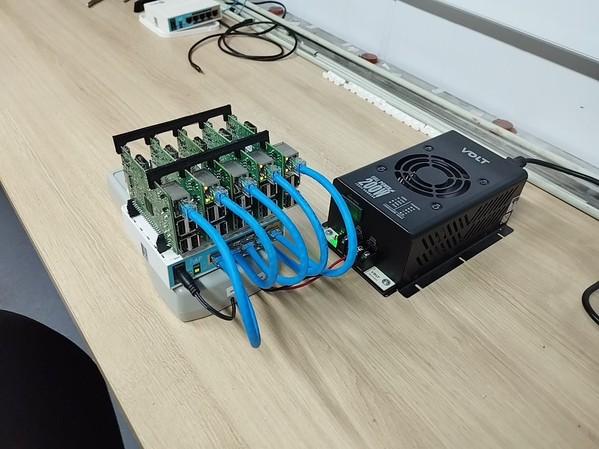

# Cluster Raspberry Pi para estudos de projetos com IA, LLMs, Docker, etc


Este repositório documenta o desenvolvimento de um cluster de Raspberry Pi para rodar modelos de linguagem como o Qwen3 via [Ollama](https://ollama.com), com otimizações de memória usando ZRAM e swap.


### 💻 Hardware
- 1x Raspberry Pi 4 (4GB RAM) – Nó Master
- 3x Raspberry Pi 3 (1GB RAM) – Nós Slaves
- 1 Mikrotik para Interconexão dos Nós
- Cabos Ethernet para todos os nós
- 2 Coolers de 12V para resfriamento


### ⚡ Power
- Fonte de Alimentação VOLT 24V 7A 200W
- Regulador de Tensão com fornecimento para até 20A de sáida para Alimentação das Rasps
- Barramentos para Organização
- Conector Jack Para Alimentação do Mikrotik
- Fios Jumpers para Alimentação das Pis via GPIO
  

### ⚙️ Software
- Ubuntu Server 20.04 LTS ARM64
- Docker + Docker Swarm
- [Ollama](https://ollama.com) (executando modelos quantizados GGUF)
- ZRAM + SWAP configurados nos Pi 3
- SSH + Docker context para gerenciamento remoto


### 🔧 Estrutura (Patolla + Impressão 3D)

- Caixa Patolla para Organização do Sistema de Alimentação (Power)⚡
- Suportes 3D para Encaixe e Organização das Raspberry Pis
- Suporte 3D para os Coolers
- Suportes para encaixes entre os dispositivos


##
<p align="center">
  
</p>


## ⚙️ Configuração do Docker Swarm

### 1. Instalação do Docker (todos os nós)

```bash
curl -fsSL https://get.docker.com -o get-docker.sh
sudo sh get-docker.sh
```

Verifique a instalação:

```bash
docker --version
```

### 2. Inicializar o Swarm (no nó master - Pi 4)

```bash
docker swarm init --advertise-addr <IP_DO_MASTER>
```

Copie o token de join exibido após a inicialização.

### 3. Adicionar os nós workers (Pi 3)

```bash
docker swarm join --token <TOKEN_COPIADO> <IP_DO_MASTER>:2377
```

### 4. Verificar os nós (no master)

```bash
docker node ls
```

---

## 📦 Deploy de Serviços com Docker Swarm

Crie um arquivo `docker-compose.yml` com o serviço desejado:

```yaml
version: "3.8"

services:
  ollama:
    image: ollama/ollama
    ports:
      - "11434:11434"
    volumes:
      - ollama:/root/.ollama
    deploy:
      replicas: 1
      placement:
        constraints:
          - node.hostname == rpi-master

volumes:
  ollama:
```

Deploy com:

```bash
docker stack deploy -c docker-compose.yml llm-cluster
```

Verifique:

```bash
docker service ls
```

---

## 🧠 Executando LLMs com Ollama

Ollama é uma ferramenta leve para executar modelos LLM localmente. Ideal para dispositivos com recursos limitados como Raspberry Pi.

Após subir o serviço com Docker:

```bash
ollama run qwen:0.6b
```

Ou via API:

```bash
curl http://localhost:11434/api/generate -d '{
  "model": "qwen:0.6b",
  "prompt": "Olá, tudo bem?"
}'
```

## 📚 Conteúdo

- `docs/arquitetura.md` – Esquema de rede, distribuição dos nós, IPs.
- `docs/instalacao-ollama.md` – Passo a passo para instalar o Ollama e rodar LLMs.
- `docs/otimizacoes.md` – ZRAM, swap, trimming de RAM, performance.
- `scripts/` – Scripts Bash.


## 🤖Atualizações de Configurações, Testes, Relatórios e Scripts Automaatizados em breve


## 🧠 Integração com N8N para Agentes de IA

O cluster agora também suporta o [N8N](https://n8n.io), uma plataforma de automação de fluxos que permite integrar e orquestrar tarefas automatizadas. Com essa integração, é possível utilizar a API do Ollama local para criar agentes de IA diretamente nos fluxos do N8N.

### 📦 Atualização do `docker-compose.yml`

```yaml
version: "3.8"

services:
  ollama:
    image: ollama/ollama
    ports:
      - "11434:11434"
    volumes:
      - ollama:/root/.ollama
    deploy:
      replicas: 1
      placement:
        constraints:
          - node.hostname == rpi-master

  n8n:
    image: n8nio/n8n:latest
    ports:
      - "5678:5678"
    environment:
      - N8N_BASIC_AUTH_ACTIVE=true
      - N8N_BASIC_AUTH_USER=admin
      - N8N_BASIC_AUTH_PASSWORD=admin123
      - N8N_HOST=localhost
      - N8N_PORT=5678
    volumes:
      - n8n_data:/home/node/.n8n
    deploy:
      replicas: 1
      placement:
        constraints:
          - node.hostname == rpi-master

volumes:
  ollama:
  n8n_data:


### 🚀 Deploy da Stack com N8N

Execute no nó master do cluster:

```bash
docker stack deploy -c docker-compose.yml llm-cluster
```

Verifique os serviços ativos:

```bash
docker service ls
```

Acesse o N8N via navegador em:

```
http://<IP_DO_MASTER>:5678
```

- **Usuário**: `admin`
- **Senha**: `admin123`

> O serviço `ollama` pode ser chamado diretamente como `http://ollama:11434` dentro do fluxo no N8N, pois ambos estão na mesma rede Docker.

---

### ✅ Status Atualizado

- [x] Ollama rodando via Docker Swarm
- [x] Modelos Qwen3:0.6b e Qwen3:1.7b testados com sucesso
- [x] N8N adicionado à stack com autenticação básica
- [x] Fluxo de automação com IA usando o modelo local do Ollama no N8N
- [ ] Painel web integrado com interface personalizada (em desenvolvimento)


## 🚀 Novas funcionalidades: Benchmark de LLMs no Cluster

O projeto agora possui um **módulo de benchmark automatizado** para avaliar o desempenho de modelos LLM instalados via [Ollama](https://ollama.com/) diretamente no Cluster de Raspberry Pi.

### 🔧 Funcionalidades implementadas:

- ✅ Detecção automática de todos os modelos instalados no Ollama
- ✅ Filtragem dos modelos compatíveis com o hardware (ex.: Raspberry Pi 4 com 4GB de RAM)
- ✅ Execução de benchmarks com coleta das seguintes métricas:
  - ⏳ Tempo total de inferência
  - 🔥 Pico de uso de CPU
  - 🧠 Pico e consumo médio de memória RAM
  - 📜 Resultado da inferência com o prompt definido
- ✅ Geração de relatórios completos em `.txt` com todos os dados
- ✅ Arquivo de configuração (`config.yaml`) para customizar:
  - Prompt utilizado
  - Intervalo de coleta de métricas
  - Lista de modelos a serem testados
  - Outras opções de monitoramento

### 🤖 Modelos testados no benchmark:

- **yi-coder:1.5b** — 866 MB
- **starcoder:1b** — 726 MB
- **deepseek-coder:1.3b** — 776 MB
- **smollm2:360m** — 725 MB
- **tinyllama:1.1b** — 637 MB
- **phi4-mini** — 2.5 GB
- **orca-mini:3b** — 2.0 GB
- **gemma2:2b** — 1.6 GB
- **llama3.2:1b** — 1.3 GB
- **qwen3:0.6b** — 522 MB
- **qwen3:1.7b** — 1.4 GB
- **llama3.2:latest** — 2.0 GB

### 🧠 Próximas melhorias:

- 🔗 Integração com **LangChain** para:
  - Construção de chains de prompts para testes mais complexos
  - Simulação de agentes e fluxos multi-etapas
  - Avaliação de raciocínio, recuperação de informações e execução de tarefas compostas
- 📄 Produção de um artigo técnico comparando desempenho em diferentes modelos de Raspberry Pi

---

